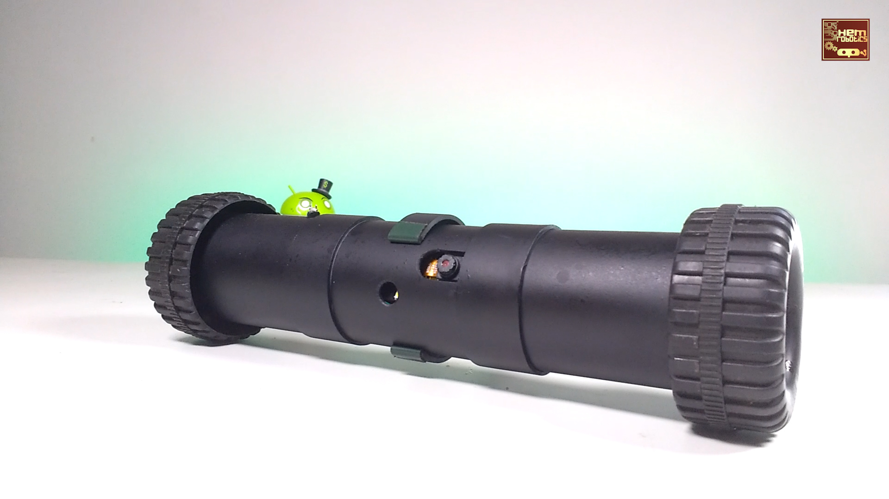

# recon-drone

This repository contains code for a drone inspired by the drone from
[Tom Clancy's Rainbow Six®
Siege](https://www.ubisoft.com/en-us/game/rainbow-six/siege) —
Ubisoft®. It uses a ESP32-CAM module. It can be controlled over WiFi.

Watch the [video on YouTube](https://youtu.be/NfWd9Kn30i0) for
complete build guide.

## Schematic diagram
The following schematic diagram shows all the components along with
their connections.

## How to use the code?
- Follow the video and the schematic diagram to make the connections. 
- Open `recon-drone.ino` in Arduino IDE.
- Select correct camera model by commenting / un-commenting correct
  `#define` statement.
- Add SSID and password of your WiFi access point.
- You can either flash your ESP using [Arduino
  UNO](https://youtu.be/q-KIpFIbRMk) or [FTDI USB to TTL serial
  converter](https://youtu.be/tzmcXZ-irIc).
- Once ESP32 CAM is connected to WiFi, you can get it's IP address in
  the serial monitor of Arduino IDE.

## Licensing & credits
recon-drone is licensed under Apache License Version 2.0. See
[LICENSE](./LICENSE) for the full license text.

This code is based on
[CameraWebServer](https://github.com/espressif/arduino-esp32/tree/master/libraries/ESP32/examples/Camera/CameraWebServer)
by Espressif Systems and
[esp32cam-car](https://github.com/heets-silver/esp32cam-car) by
heets-silver. Both are licensed under Apache License Version 2.0.
